# 空气当量换算计算程序开发

本文改编自作者的本科毕业论文《水蒸汽空气当量换算及计算程序开发》，作者为苏尚君，程序开发者为苏尚君。特别注明是为了万一查重把这部分互联网资源也纳入查重范围，那我的毕业论文重复率估计要上80~90%。。。

喷射泵是一种常见的真空获得设备，广泛应用于化工、环保、生工领域，处理的气体种类较多，而实际在工厂中不可能有那么多的专用泵。因此在为待处理系统实际选配泵时，需要将待处理气体转换成当量空气量，从而进行能力核算。本程序根据相关标准[1]，设计了对于独立喷射泵的能力核算可用的计算程序，并开发了一套图形界面以降低操作复杂度，以及满足某些特定条件下的使用（如仅有触摸输入而无附加键盘等输入外设的情况）

## 程序结构

程序包含 2 个类，10 个函数，列表如下

1. 类

  - Gas_item
  - Keyboard
  
2. 函数

  - 键盘调用
        - 质量输入键盘调用
        - 温度输入键盘调用
  - 标准计算方法所需图像数字化后所得函数
        - 温度-夹带比（引射系数）函数（空气）
        - 温度-夹带比（引射系数）函数（水蒸气）
        - 分子量-夹带比（引射系数）函数
    - 读取数据
    - 添加项目
    - 查看已添加项目
    - 清空项目
    - 计算

## 结构介绍

### 类

- Gas_item

    每次添加一个新项目时，将以下几样属性打包成一个对象，对象是类 Gas_item 的一个实例

    - 名称
    - 质量
    - 质量单位（使用 SI 与否，即使用 Kg/s 还是 Lbs/hr）
    - 温度
    - 温度单位（使用摄氏度 °C 与否）

- Keyboard

    当程序被置于无键盘状态下使用时（例如：流水线前台触屏电脑），可使用该类实例化出一个键盘，从而通过直接点击键盘，可输入数据。键盘的 2 种实例化均包含

- 9 个数字键

    用于输入数字

- 1 个小数点键
- 1 个输入框

    点击数字键/符号键，将在输入框文本尾部添加对应输入

- 1 个按钮

　　该按钮用于将输入框中的文本传递到主窗体中对应的数据获取栏中。例如，单击「质量」按钮而弹出的键盘窗体中的该按钮，将把键盘窗体中获取的输入转移到主窗体中的「质量」输入框中

### 函数

- 键盘调用

    1. 质量输入键盘调用
    
        点击按钮「质量」将调用该函数，若函数检查到当前并未弹出名为「质量」的键盘，则弹出一个新的键盘面板窗体，窗体名为「质量」，为类 Keyboard 的 1 个实例。可直接在键盘面板上输入数据，例如，先后点击键盘按钮 「1」、「1」、「.」、「8」、「9」，点击「将输入复制到主窗口」，则数据「11.089」将被复制到主窗体的按钮「质量」下的文本框中（即质量输入栏）。

    2. 温度输入键盘调用

        点击按钮「温度」将调用该函数，若函数检查到当前并未弹出名为「温度」的键盘，则弹出一个新的键盘面板窗体，窗体名为「温度」，为类 Keyboard 的 1 个实例。可直接在键盘面板上输入数据，例如，先后点击键盘按钮 「-」、「1」、「1」、「.」、「8」、「9」，点击「将输入复制到主窗口」，则数据「11.089」将被复制到主窗体的按钮「温度」下的文本框中（即温度输入栏）。

- 标准计算方法所需图像数字化后所得函数（以下函数通过对 [1] 的图 15 与图 16 取点[4]并经函数拟合得到[5]）

    1. 温度-夹带比（引射系数）函数（空气）

        通过如上 2.2.3 所示部分拟合所得函数。当待计算项目为「空气」，且温度在 70 ~ 1000 °F 或 21.111 ~ 537.778 °C 范围内时，将换算得到相应的夹带比（引射系数）供使用

    2. 温度-夹带比（引射系数）函数（水蒸气）

        通过如上 2.2.3 所示部分拟合所得函数。当待计算项目为「水蒸气」，且温度在 70 ~ 1000 °F 或 21.111 ~ 537.778 °C 范围内时，将换算得到相应的夹带比（引射系数）供使用

    3. 分子量-夹带比（引射系数）函数

        通过如上 2.2.3 所示部分拟合所得函数。当待计算项目的分子量在 0 ~ 150 范围内时，将换算得到相应的夹带比（引射系数）供使用

- 读取数据

    程序连接的数据文件应命名为 MoleWT_data.txt。数据文件格式如下：
    
        （第 1 行）气体种类数量 n  
        （第 2 行）[气体 1 中文名][空格][气体 1 英文名][空格][分子量] 
        ……
        （第 i 行）[气体 i 中文名][空格][气体 i 英文名][空格][分子量]
        ……
        （第 n + 1 行）[气体 n 中文名][空格][气体 i 英文名][空格][分子量]
        （第 n + 2 行）（本行为空行，特别重要！）
    
    以上所示格式中每行开头的「（第 i 行）」仅作提示作用，实际文件中不需要输入该串字符；格式中，若将方括弧「[]」及其内对应的信息视为一组，则实际文件中，用方括弧中对应信息替换格式中的这组信息所占位置（包含方括弧）。以下是一个数据文件的范例：
    
        6
        水蒸气 steam 18
        空气 air 29
        二氧化碳 co2 44
        氮气 n2 28
        氩气 ar 40
        氦气 he 4
        （此处为空行）
    
    若格式正确，且分子量在规定范围中，则程序读取文件成功，程序将成功建立窗体，包括
    - 质量输入框
    - 温度输入框
    - 质量单位单选框
    - 温度单位单选框
    - 气体名称选择菜单
    - 调用质量输入键盘面板的按钮「质量」
    - 调用温度输入键盘面板的按钮「温度」
    
    若格式错误，或分子量不在给定范围内，则将分别给出提示。例如，当出现如下格式错误时，将提示「文件损坏或不存在。请阅读帮助文档，修改或创建数据库文件」。

    格式错误范例 1：气体中文名与英文名之间缺漏空格，例如
    
            3
            水蒸气steam 18
            空气 air 29
            二氧化碳 co2 44
      
    格式错误范例 2：气体缺少分子量
    
            3
            水蒸气 steam
            空气 air 29
            二氧化碳 co2 44
      
    格式错误范例 3：给出气体种类数 n，而实际所给的种类数不足 n
    
            3
            水蒸气 steam
            空气 air 29

    格式错误范例 4：缺了最后一个空行
    
            3
            水蒸气 steam 18
            空气 air 29
            二氧化碳 co2 44（此处为文件尾）
    
    例如，当出现如下分子量错误时，将提示「允许计算的分子量数值范围：大于 0，不超过 150。请检查并至少修改数据库中该项目的分子量：水蒸气」。
    
            3
            水蒸气 steam 0
            空气 air 29
            二氧化碳 co2 44
        
    如下例子所示的数据文件也属于分子量错误，同样对水蒸气提示错误：
    
            3
            水蒸气 steam 160
            空气 air 29
            二氧化碳 co2 44
    
    这里所说的分子量的规定范围是指 (0, 150]，这是因为参考文献 [1] 即计算所参考的标准给出的图 16 分子量-夹带比（引射系数）曲线图中，仅给出了分子量为 0~150 之间的夹带比（引射系数）数据，因此在此范围外的分子量将被程序视为非法值。

- 添加/修改/删除项目

    在程序初启动时，未添加任何项目。此时，选择待添加项目的名称、在质量输入框中输入了数值、在温度输入框中输入了数值、选择了相应的质量单位和温度单位后，点击「添加/修改/删除」按钮，程序将首先检查输入是否合法。其中，输入合法是指：
    
    - 质量为非负数值
    - 温度在 70 ~ 1000 °F 或 21.111 ~ 537.778 °C 范围内
     
    若质量输入非法，将提示「[质量]：请输入**非负数**」。
    若温度输入非法，将提示「[温度]：请输入数字(70 ~ 1000 °F 或 21.111 ~ 537.778 °C)」。
    
    检查输入合法后，程序将建立一个新的计算组（每一个新温度 t(i) 对应一个计算组），向新计算组中加入该项目。且此时，由于程序中待计算项目列表（在程序内部的具体实现方式是 python 的字典类型）非空，将出现 3 个新按钮，即「已输入」、「清空」、「计算」，分别对应以下 3 个函数（查看已添加项目、清空项目、计算）。
    
    此后，若列表中已经存在温度为 t 的项目 item，希望修改 item 的质量时，可在选项菜单（即「名称：」右侧的选项菜单）中选择 item，在温度输入框中输入 t 并选择对应的温度单位，在质量输入框中输入新的质量并选择单位，之后点击「添加/修改/删除」按钮，一旦输入合法，那么以温度 t 为索引的计算组下的项目 item 将被更新。
    
    在同一温度下，只有 1 个温度计算组（以下简称「计算组」或「温度组」）。程序保证计算精度控制在小数点后 2 位小数的状态下时，华氏度输入与摄氏度输入视为同一温度组输入。例如，温度 167 °F 与温度 75 °C 被视为同一温度组；温度 75 °F 与温度 23.89 °C 与 23.889 °C 被视为同一温度组。在同一计算组下，每种气体项目仅存在 1 项，例如，在温度 75 °F 对应的计算组下，不允许同时存在质量为 5 lbs/hr 的水蒸气项目和 3 kg/s 的水蒸气项目，这也意味着在同一计算组下，对已经存在的项目改变质量数值（非 0）后点击按钮，仅仅触发「修改」功能而不触发「添加」功能。而不同计算组下允许同时存在同样质量和同样名称的项目，例如，允许在 75 °F 计算组与 76 °F 计算组中都存在质量为 5 lbs/hr 的计算组，如图所示
    
    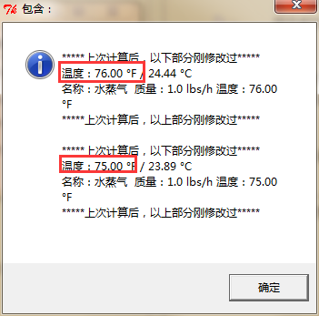
    
    图3.1　不同计算组中允许同名称项目
    
    若希望删除温度 t 的计算组下的项目 item，只要在温度输入框中输入 t 并选择对应的温度单位，于质量输入框中输入 0，无论选择什么单位，此后点击「添加/修改/删除」按钮，则温度 t 对应的计算组中的项目 item 将被删除。特别地：
    
     - 如果一个温度 t 的计算组下的所有项目均被删除，则该计算组将被整个删除，无法在「已输入」中查看到该计算组
     - 如果所有计算组均被删除，即虽然不是点击「清空」，但功能上清空了待计算项目，则逻辑上与「清空」效果一致，即将使窗体界面恢复到最开始等待添加第 1 个项目输入的界面。
    
    该函数在检查输入合法后的流程为：
    - 质量为 0？
      - 质量非 0
          1. 输入的温度是否存在？
              - 温度未存在
                  - 在待计算字典中建新温度下的待计算组，列表类型（list）
                  - 向该列表中添加一个标签为温度 temperature 的列表，列表下含有 2 个项目
                      - [0]：状态「本轮计算中该组是否被修改过」，初始化为「被修改过」
                      - [1]：新建待计算组字典（空字典）
          2. 向以该温度为索引的列表中的计算组字典添加该项目
          3. 将以该温度为索引的列表中的状态修改为「本轮计算中该组被修改过」
      - 质量为 0
          - 输入的温度是否存在？
              - 温度已存在
                  - 以该温度为索引的计算组（字典）中含有与输入项目名称一致的元素？含有
                      - 以该温度为索引的二级字典只含 1 个元素
                          - 删除以该温度为索引的二级字典(即dicts.pop(key))
                      - 以该温度为索引的二级字典所含元素超过 1
                          - 从该二级字典中移除该元素
                          - 将以该温度为索引的列表中的状态修改为「本轮计算中该组被修改过」
                  - 以该温度为索引的二级字典中含有与输入项目名称一致的元素？不含有
          - 什么都不做（若没有，即「温度存在，质量为 0 ，试图删除该项目」，但由于二级字典中没有该项目，因此移除项目无从谈起，忽略该输入）
              - 温度不存在
                    - 什么都不做（若质量为 0 且待计算字典中不存在这样的温度对应的二级字典，则没有待删除的对象，忽略这样的输入）
    
    该部分的流程图如下
    
    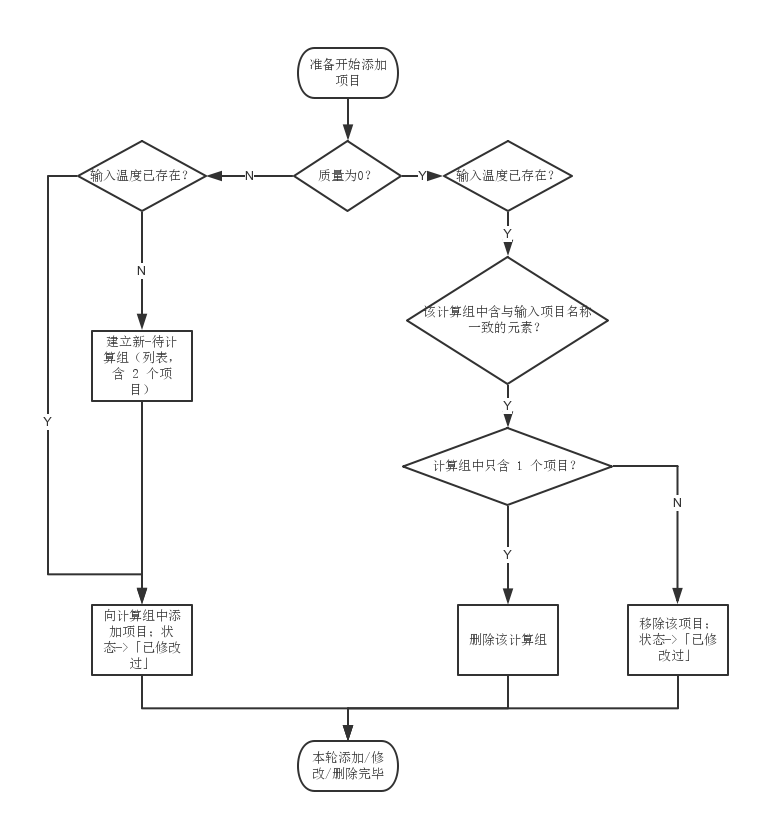
    
    图3.2　「添加/修改/删除」按钮执行逻辑

- 查看已添加项目

    单击按钮「已输入」后，将弹出对话框，对话框中展示的内容，以温度为分组标志，分别展示每个计算组下的各项目输入原始数据（名称、原始输入质量流量值及其单位、原始输入温度值及其单位）。如果某一温度组在上一次计算后被修改过（在上一次计算后新添加的组也计为此状态），则内容将被特别标注出来，如图所示。
    
    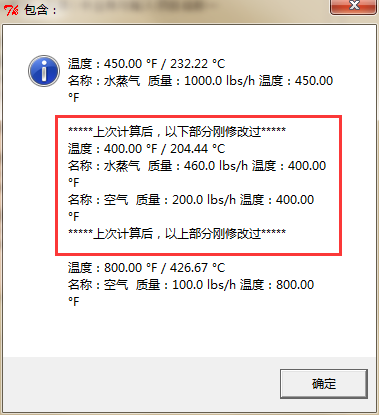
    
    图3.3　查看已添加项目（标注新修改组）
    
    若在上一次计算后并未添加新项目，点击该按钮，将展示之前添加的所有项目，没有特别标注，如图所示。
    
    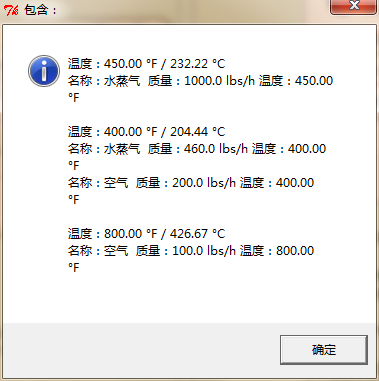

    图3.4　查看已添加项目（上次计算后没有修改）

- 清空项目

    单击按钮「清空」后，将弹出对话框以向用户确认清空意愿，防止误操作。一旦用户确认，将清空历史输入列表，且主窗体界面将恢复到初始待输入状态。

- 计算

    单击按钮「计算」后，程序将创建一新列表，新列表为待计算列表的一个副本，在此列表中进行循环，直至把每个计算组遍历结束。每历经一个计算组，将首先检查该计算组在此次点击「计算」前是否被修改过，若没有被修改过，意味着之前已经计算过了，便直接调用存储在结果字典中的数据；若计算组被修改过，则首先进行数据处理，即首先完成以下几样工作，对数据进行预处理：
    
    1. 遍历该温度组中的所有项目，判断是否存在空气、是否存在水蒸气、是否存在其它气体。同时，若发现某一项目不使用 lbs/hr 与 °F 单位制，则将新列表中该项目修改为 lbs/hr 与 °F 单位制 
    2. 遍历该温度组中的所有项目，计算出了水蒸气以外的所有项目的总质量与总摩尔数（分子的量 n）
    
    完成以上预处理后，对于修改后的新列表，按照上面 2.1 所示的逻辑，对计算组中的项目进行遍历，计算并将结果保存，并特别标注。
    在遍历完后，将弹出窗口，在一个窗口中显示每个计算组的计算结果，以供比较各组气体对应的 70 °F 空气当量值。对于新修改过的计算组的计算结果，将被特别标注出，以便引起用户特别注意，防止混淆。如图所示。

    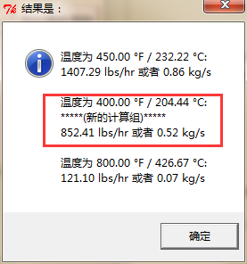
    
    图3.5　新计算结果被特别标注

    程序核心计算逻辑为

    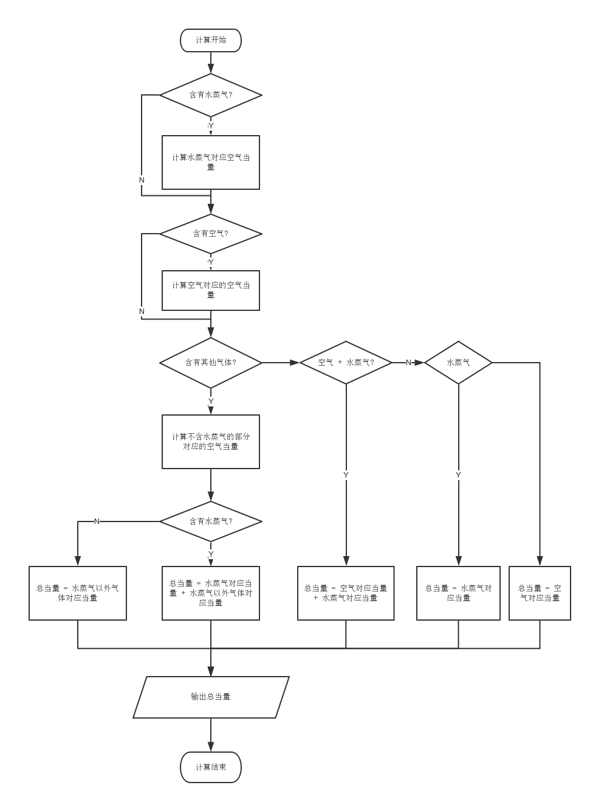

    图3.0　核心计算逻辑

## 程序运算实例

以下主要使用来自于参考文献 [1] 即美国热交换学会（Heat Exchange Institute, HEI）为真空喷射泵制定的标准中使用的计算实例，来验证程序。

1. 仅有空气

    质量为 100 lbs/hr，温度为 800 °F 的空气待求 70 °F 空气当量，在「名称」旁的菜单中选择「空气」，因此在质量输入栏中输入 100，质量流量单位选择 lbs/hr，在温度输入栏中输入 800，温度单位选择 °F。
    
    点击「添加/修改/删除」按钮，单击「已输入」，确认输入无误。
    点击「计算」，弹出窗口给出计算结果 121.10 lbs/hr，如图所示，与参考文献 [1] 所示的结果 121.1 lbs/hr 一致。即该流程计算无误。

2. 仅有水蒸气

    质量为 1000 lbs/hr，温度为 450 °F 的水蒸气待求 70 °F 空气当量，选择在质量输入栏中输入 1000，质量流量单位选择 lbs/hr，在温度输入栏中输入 450，温度单位选择 °F。
    点击「添加/修改/删除」按钮，单击「已输入」，确认输入无误，如图所示。
    由于在上一次计算后新添加了新计算组（450 °F），因此该计算组在「输入」对话框中被特别标注出。确认无误后，点击「计算」，弹出的对话框中特别标注出了新计算组的计算结果，显示为 1407.29 lbs/hr。
            
    这个结果与参考文献 [1] 所示的结果 1411 lbs/hr 十分接近，结果的误差可视为标准编写者在图上手工取点时所得值与我通过计算机取点拟合函数计算所得值之间的误差造成的。即该流程计算无误。

3. 空气、水蒸气混合物

    质量为 660 lbs/hr，温度为 400 °F 的空气水蒸气混合物中，包含了 200 lbs/hr 的空气，以及 460 lbs/hr 的水蒸气，求该混合物的 70 °F 空气当量。在选项菜单中选择「水蒸气」，点击「温度」按钮，使用键盘面板输入 400，点击「将输入复制到主窗口」，从而在温度输入栏中输入 400，选择 °F。
    
    再点击「质量」按钮，使用键盘面板输入 460，点击「将输入复制到主窗口」，从而在质量输入栏中输入 460，选择 lbs/hr，点击「添加/修改/删除」按钮，再单击「已输入」，确认输入无误。
    
    此时添加另一项目：在选项菜单中选择「空气」，点击「温度」按钮，使用键盘面板输入 400。此时在未关闭温度输入面板的情况下反复点击「温度」，发现不会弹出新窗口；「质量」按钮，同时反复点击「温度」与「质量」，并未弹出新窗口。在关闭任一键盘面板后，再点击对应的按钮，例如，关闭了「质量」，再点击「质量」，则会弹出「质量」面板。以上操作，这意味着线程控制成功。
    
    点击「将输入复制到主窗口」，从而在温度输入栏中输入 400，选择 °F，如图所示。
    
    在质量输入栏中输入 2000，选择 lbs/hr，点击「添加/修改/删除」按钮，再单击「已输入」，在弹出的对话框中检查，如图所示。
    
    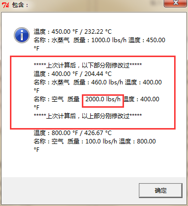

    图3.6　空气质量输入错误
    
    发现新添加的项目中，空气质量输入错误。因此回到主窗体，将质量输入框中的值修改为 200，确认单位无误，单击「添加/修改/删除」按钮，再单击「已输入」，在弹出的对话框中检查，如图所示。
    
    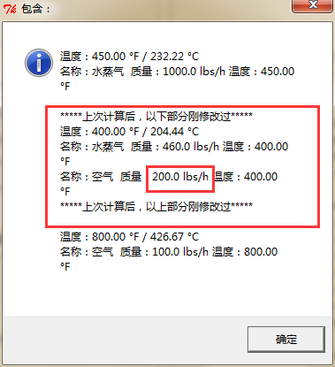

    图3.7　修改空气质量输入
    
    发现项目修改成功，计算组中项目无误，从而点击「计算」，弹出的对话框中特别标注出了新计算组的计算结果，显示为 852.41 lbs/hr。
    
    这个结果与参考文献 [1] 所示的结果 854 lbs/hr 十分接近，对结果误差的解释如上。

4. 气体混合物（不含水蒸气）

    对质量流量为 6 lbs/hr 的 CO2、质量流量为 24 lbs/hr 的 N2、质量流量为 62 lbs/hr 的 Ar、质量流量为 108 lbs/hr 的 He 的混合物，求该混合物的 70 °F 空气当量。首先，由于这个计算组中不含空气和水蒸气，因此要把这 2 个项目删除。选择「名称」旁的选项菜单中的「空气」，在质量输入栏中输入 0，点击「添加/修改/删除」按钮；选择「名称」旁的选项菜单中的「水蒸气」，在质量输入栏中输入 0，点击「添加/修改/删除」按钮。单击「已输入」，在弹出的对话框中检查，如图所示。
    
    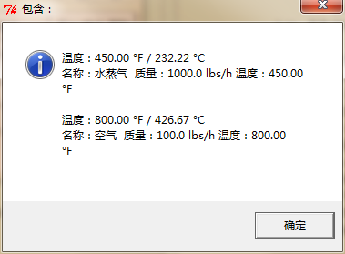

    图3.8　检查删除是否成功

    发现 400 °F 计算组已经被删除，因此接下来可以添加以下以上各项目。选择「名称」旁的选项菜单中的「二氧化碳」，质量输入栏输入 6，单位选择 lbs/hr，温度输入栏输入 400，温度单位选择 °F；选择「名称」旁的选项菜单中的「氮气」，质量输入栏输入 24，单位选择 lbs/hr，温度输入栏输入 400，温度单位选择 °F；选择「名称」旁的选项菜单中的「氩气」，质量输入栏输入 62，单位选择 lbs/hr，温度输入栏输入 400，温度单位选择 °F；选择「名称」旁的选项菜单中的「氦气」，质量输入栏输入 108，单位选择 lbs/hr，温度输入栏输入 400，温度单位选择 °F。单击「已输入」，在弹出的对话框中检查，如图所示。

    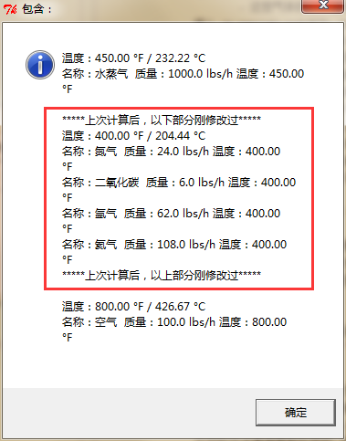
    
    图3.9　检查新输入

    检查发现输入无误，点击「计算」，弹出的对话框中特别标注出了新计算组的计算结果，显示为 492.55 lbs/hr。
    参考文献 [1] 所示的结果为 472 lbs/hr，这个结果与程序计算结果有一定差值，但误差仍可以如上解释。原因阐释如下：在程序代码的计算函数 calculation 中的 `if not error_flag` 分支下的 `if exist_other_g` 分支下，计算出不含水蒸气的所有气体的混合物对应的空气当量后，判断是否存在水蒸气前，在此处加入以下代码
    
        #####test use this part#####
        print "m_sum: %.2f\n" % m_sum
        print "avg_moleweight: %.2f\n" % avg_moleweight
        print "mole-entrainment ratio: %.2f\n" % molewt_entrainment_ratio(avg_moleweight)
        print "m_sum / mole-entrainment ratio = %.2f\n" % temp_m
        print "t-entrainment ratio: %.2f\n" % t_entrainment_ratio_AIR(temperature)
        print "result: %.2f\n" % equivalent_mix_without_steam[i]
        #####test use this part#####
    
    这几行分别打印出：

    - 不含水蒸气的气体的质量总和 m_sum
    - 这些气体的平均分子量 avg_moleweight
    - 该平均分子量 avg_moleweight 对应计算出的夹带比（引射系数）
    - 这些气体的总质量通过除以以上夹带比得到的空气当量（使用温度-夹带比换算前）
    - 该温度组的温度计算出的夹带比（引射系数）
    - 最终换算结果
    
    加入这些代码，按本小节所阐述的如上步骤运行程序后，在控制台端看到：

    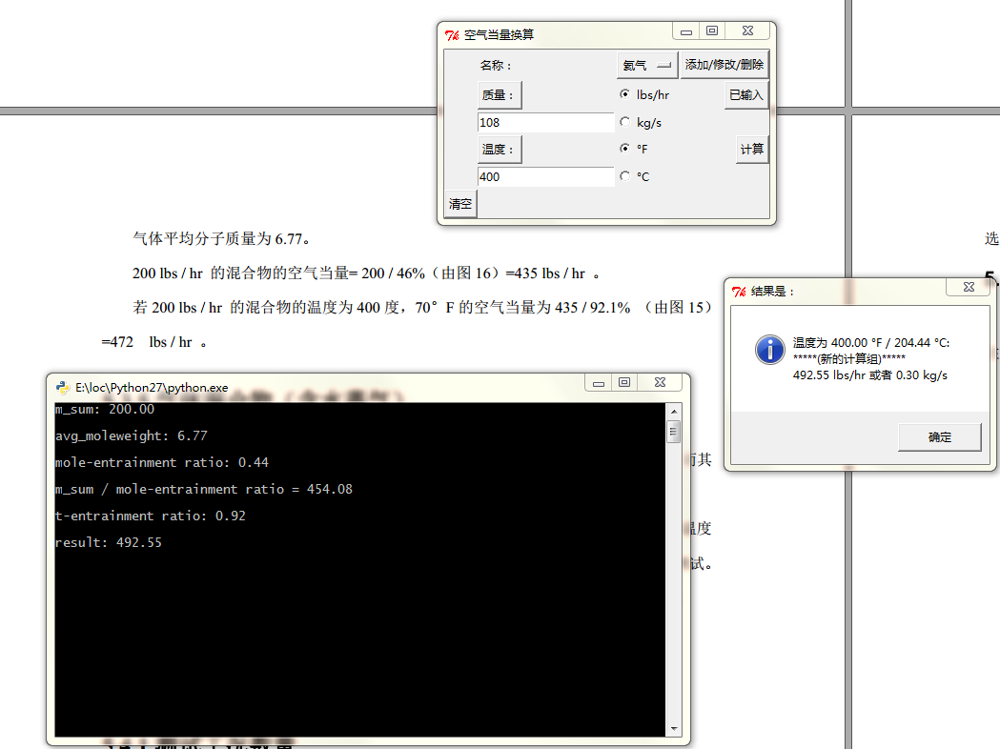
    图3.10　测试代码运行结果

    - 不含水蒸气的气体的质量总和 m_sum：200.00，与参考资料 [1] 所示一致
    - 这些气体的平均分子量 avg_moleweight：6.77，与参考资料 [1] 所示一致
    - 该平均分子量 avg_moleweight 对应计算出的夹带比（引射系数）ratio-moleWT：0.44，参考资料 [1] 所示为0.46，从参考资料图 16 中的夹带比尺度看出，这个差别很小，是可接受的
    - 这些气体的总质量通过除以以上夹带比得到的空气当量（使用温度-夹带比换算前） m_sum/ratio-moleWT：200 / 0.44 = 454.08（实际上由于 0.44 是精确到小数点后 2 位的显示结果，因此实际上 200 / 0.44 = 454.54，然而考虑到尺度，这个结果与 454.08 是一个尺度的。如下的 492.55 也是因为同样的原因，不再解释）。即第一次误差由可接受的分子量-夹带比（引射系数）小偏差引起。
    - 该温度组的温度计算出的夹带比（引射系数）ratio-temperature：0.92，资料 [1] 所示为 0.921，考虑到图 15 中夹带比尺度，这个差别很小，可以认为是可接受的
    - 最终换算结果 (m_sum/ratio-moleWT) / ratio-temperature：454.54 / 0.92 = 492.55，即总误差由于对参考资料 [1] 的图 15 和图 16 取点的读数差别造成。而这 2 个读数误差均在可接受的范围内，事实上由于取点足够密集，函数拟合程度高，因此人工读数只会比计算得出的结果误差更大，故而这个结果是可接受的。

5. 气体混合物（含水蒸气）

    由于参考资料 [1] 未提供这种情况的计算示例，而这种情况也极其简单：按照 4. 气体混合物（不含水蒸气） 所示过程计算不含水蒸气的混合物的 70 °F 空气当量，再加上按照 3.3.2 仅有水蒸气 所示过程计算得到的水蒸气对应的 70 °F 空气当量，两个结果相加即可。

## 版本演进

### 版本 1

在设计早期设计出的第一个 GUI 版本中，曾经考虑过采用格式化字符串的方式来处理输入，即强制要求用户按照一定的格式输入待计算项目的数据，包括：名称、宏观质量、质量单位、温度、温度单位。具体操作实例如下：

例如，希望计算在 800°F  下 100 lbs/hr 的空气对应的 70 °F 空气当量，则在输入栏中输入`air#100#Y#800#Y`，点击「添加项目」。随后可点击「已添加项目」查看当前添加的项目。确认无误后，点击计算，将给出结果，如图所示，约为 121.10 lbs/hr。

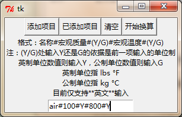

图3.11　版本 1 界面

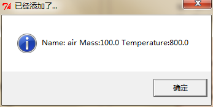

图3.12　版本 1 添加结果

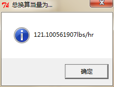

图3.13　版本 1 计算结果

这种设计最终被抛弃，一方面是因为考虑到这样输入对于用户而言不够直观，复杂度仍然比较高，一不小心就可能输错，这样的输入方式仍然有点保留了命令行状态下的交互方式；另一方面，在这一版本中，待计算气体的分子量数据是被固化在程序中的，这不利于用户对计算数据的自定义，而由于前文表明，实际使用环境中，待处理气体可能是多样化的，因此为用户提供一个接口用于向计算程序内部导入待处理气体的分子量数据是极为必要的。

### 版本 2

随后设计出的第二个版本中，首先通过外部附加一个按特定格式编辑的、易通过记事本等简易的文本编辑器修改的数据文件（为 windows 系统下的普通文本类型，即txt格式），通过在程序开始前导入该文件，即可完成对待处理气体分子量数据的导入。通过这一方式，解决了用户对计算程序自定义待处理气体分子量的问题。如图所示。

图3.14　版本 2 读取文件界面1

图3.15　版本 2 读取文件界面2

图3.16　版本 2 读取成功界面

通过增加输入框、增加单选框解决了前一问题，即用户可自行输入项目名称、项目质量、项目温度，通过点击选项自行选择质量单位、温度单位。在这一版本中，伴随着控件增加，出现了中文支持问题，因此暂时改为使用英文界面与用户进行交互。同样的，在这个版本中，通过外部数据文件导入的项目名称仅支持英文。

例如，希望计算在 450°F  下 1000 lbs/hr 的水蒸气对应的 70 °F 空气当量，由于在数据文件中定义了 steam 项，则在 Name 中输入 steam，在 Mass 栏中输入 1000，单位选择 lbs/hr，Temperature 栏中输入 450，单位选择 degree F，点击「Add/Modify/Delete」，添加成功。

图3.17　版本 2 添加成功

如图，点击 Already 查看已添加项目，确认无误，点击「CALC」计算，得到结果约为 1407.29 lbs/hr 或 0.86 kg/s。即这个版本中，还将结果进行单位换算后表示出两种单位制的结果。

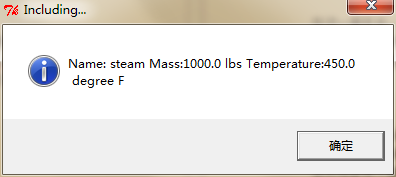

图3.18　版本 2 已添加项目（Already）

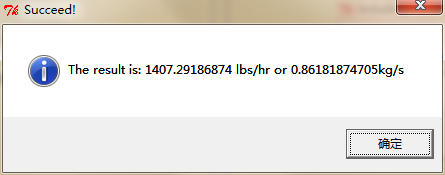

图3.19　版本 2 计算结果（CALC）

在这一版本中，存在的问题，除了上文提到的中文支持问题以外，还存在另一个问题，那就是在每次计算时，项目名称需通过手动输入获取。而事实上既然在导入分子量数据时也导入了项目名称，是否有可能在计算时直接通过「选取」一类的操作从列表中选择呢？

### 版本 3

在这一版本中，首先解决了中文化界面的问题。考虑到中文属于 GBK 字符集，而 Python 支持 Unicode 编码（万国码），同时 Python 提供将其他字符集转码为 Unicode 的命令[2]，且 Python 自带的一个图形化 IDE 即 IDLE 是可直接通过类似记事本交互的方式直接复制内容的，因此采用了一种折衷的方案：即将所需要表示的中文字符串在 IDLE 中转码为 Unicode 之后，再将对应的 Unicode 复制到代码中对应需要的显示处。如图所示，当我需要用「计算」替换「CALC」时，我在 IDLE 中输入 “计算”.decode(“GBK”)，得到了一串 Unicode 即 `u’\u8ba1\u7b97’`，将其复制到 Python 代码中，赋值给一个临时变量 tempstring，再在该按钮对应的文本变量替换为 tempstring 即可。

另一个问题也在此版本中得到了解决，即通过构建一个选项菜单实现，菜单中的每一项即为数据文件中导入的项目名称，从而，每次需要添加项目，在选择项目名称时，只需从选项菜单中选择相应的项目即可。

例如，希望计算在 400°F  下 660 lbs/hr 的空气水蒸气混合物（其中包含 200 lbs/hr 的空气，460 lbs/hr 的水蒸气）对应的 70 °F 空气当量，在选项菜单中选择 air 项，质量输入栏中填入200，单位选择 lbs/hr，温度输入栏中填入 400，单位选择°F，点击「添加/修改/删除」，再在选项菜单中选择 steam 项，质量输入栏中填入460，单位选择 lbs/hr，温度输入栏中填入 400，单位选择°F，点击「添加/修改/删除」。如图所示。

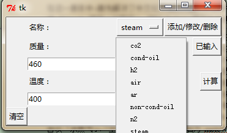

图3.20　版本 3 选择名称

随后单击「已输入」查看已经输入的项目。确认无误后，点击「计算」，看到结果约为 852.41 lbs/hr 或 0.52 kg/s。如图所示。

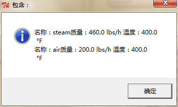

图3.21　版本 3 已添加项目

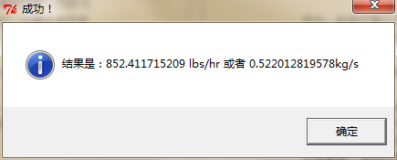

图3.22　版本 3 计算结果

这个版本中，存在以下 2 个明显的问题：

1. 虽然中文界面得到了实现，然而代码是非常不直观的，必须通过增加注释才能让阅读代码者明白，且注释容易被修改，仍然使阅读者心存疑虑
2. 虽然中文界面大体得到了实现，然而选项菜单中仍然使英文显示，不够直观
另外，老师还建议添加图形化键盘，即当程序要用在无键盘的环境下，例如流水线前的触屏终端环境下时，可通过直接点击图形化键盘来实现对数字的输入。

### 版本 4（最终版本）

这个版本即最终版本。在此版本中，首先通过将中文字符串转码的过程移植到了程序内部，即通过将待转码中文字符串 `CHS_string` 赋值给一临时字符串变量a，再对其转码结果赋值给另一临时字符串变量b，最终在需要中文字符串 `CHS_string` 的地方用 b 替代即可。例如。在质量输入错误时需要弹出对话框，希望该对话框的标题栏和内容都是中文，从而可以使用以下代码进行实现

    temptitle = "输入错误：质量"
    tempcontent = "[质量]：请输入**非负数**"
    tkMessageBox.showerror(temptitle.decode("GBK"), tempcontent.decode("GBK"))

这解决了第一个问题，即使得代码变得更直观、更易阅读、更容易使阅读者信服。

而第二个问题的解决，一方面与第一个问题的解决有关，即实现了对中文输入的读取和转码问题。另一方面，这个问题还隐含着另一个问题，即在程序内部利用了 python 的一个特色数据结构即字典（dictionary）来存储分子量等数据并在后期进行调用，而在定义 python 字典类型时，不允许使用中文字符串直接作为索引，且不允许通过如上的方式用变量进行索引，然而我在添加项目时，程序内部的实现是，通过读取选项菜单中的选项（例如此时是中文选项），添加相应的项目到待计算列表中。当需要计算时，从计算列表（待计算列表的一个新副本）中取得项目的名称，再从字典中以项目名称为索引取得该项目的分子量。这意味着，如果直接用中文选项菜单而不进行额外的处理，在计算时将无法调取相应的分子量数据；对应的另一面则是无法建立以中文字符串为索引的字典，例如，不可通过如下代码建立一个包含以「水蒸气」、「空气」为索引（键）的名为 moleWT 的字典：

    tempstring0 = “水蒸气”
    a = tempstring0.decode(“GBK”) 
    tempstring1 = “空气”
    b = tempstring1.decode(“GBK”) 
    # 无论保留以下 2 句代码任何一句，都将出错，无法建立字典dicts0 或 dicts1
    dicts0 = {a:18, b:29}    
    dicts1 = {tempstring0.decode(“GBK”) :18, tempstring1.decode(“GBK”):29}

因此，考虑了一种新的映射关系：Python 中的字典虽然是无序结构的，即存储于字典中的数据是没有顺序的，用户只能通过索引（键）对索引（键）对应的键值进行引用，而无法取得字典中的第 1 个或第 i 个值。而 Python 中存在另一种数据结构，称为列表（list），列表是有序的，且由于要求数据文件中不能存在重复的项目名（这意味着一个项目及其对应的英文名称之间是双射的映射关系，同时意味着一个项目只有一个分子量），而列表允许的一个操作是，可通过对列表的值进行查找，返回列表中第 1 个值对应的索引。这意味着，如果我建立 2 张列表，列表1中的第 i 项存储气体 i 的中文名 CHS，列表 2 中的第 i 项存储气体 i 的英文名 EN，而存储气体 i 的分子量的字典仍然用气体 i 的英文名 EN 作为索引。这样，在需要取得气体 i 的分子量时，只需要首先取得中文名，从中文名得到气体 i 的索引 i（这是在列表 1 中的索引），通过索引 i 在列表 2 中取得气体 i 的英文名 EN；最后，直接用 EN 作为索引，调用字典中气体 i 的分子量即可。通过这种方式，完成了对第二个问题的解决。

对于添加键盘而言，至少存在 1 个问题：

- 如果直接在主窗体中建立键盘，一是不够美观，二是如果要在主窗体中点击键盘的同时，直接在点击键盘前的输入位置处输入数字，当前未找到可行的获取输入状态的方法。获取输入状态的意思是，在点击键盘前光标处于哪个文本框中，这决定了点击主窗体中的键盘将把数值传递给哪个输入栏中。

为了解决这一，至少有 2 种方法：(a)在主窗体中建立一个标签或文本框用于接受图形化键盘的响应，并为图形化键盘附上 2 个按钮，点击哪个按钮，决定了要把图形化键盘的输入赋值给哪个输入栏（质量输入栏或温度输入栏）；(b)建立新的键盘窗体，在新窗体中输入完成后，将在新窗体中的输入传递到主窗体中。本设计采用了方案(b)，而这就带来了另 1 个待解决的问题：即由于使用了 Tkinter 库的 Toplevel() 方法建立新的键盘窗体，而这样建立的窗体对应的线程与主窗体是独立的，这就意味着如果没有控制好，多次调用建立键盘窗体的命令将建立 1 个以上的窗体，这将造成用户的理解和操作混乱

这是一个典型的随二元状态的不同而决定响应的问题，这可通过建立标志（flag）的方式来判断键盘窗体状态从而解决上一小个问题，这就是说，点击键盘窗体创建按钮时，检查标志，如果标志为 False，则建立窗体，当建立了 1 个温度键盘窗体时，flag[temperature] 状态为 True，关闭时，键盘窗体状态恢复 False。而如果通过按钮退出键盘窗体，这一操作容易实现；通过普通的窗体右上角的叉关闭窗体时，这一问题通过 Tkinter 的 window manager 将事件与 `WM_DELETE_WINDOW` 绑定即可实现，具体是通过在键盘窗体初始化时通过 .protocol() 方法与 `WM_DELETE_WINDOW` 绑定。[3]

该版本中添加的 3 个新功能是：

1. 每次添加项目时将根据添加项的温度是否已存在，判断要创建一个新的计算组还是存入已有计算组。不同计算组之间以温度作为索引区别。在查看已添加项目以及计算时，程序将根据温度所分的计算组分别展示项目或进行计算；在计算完成后，将展示不同的计算组计算后得到的结果，从而允许工作人员对不同组的结果进行比较。
2. 每次点击查看「已添加项目」时，会判断当前程序存储列表中的项目是否是上次计算后新添加或修改的，如果是，会特别标注出。
3. 每次点击计算，展示计算结果时，会判断当前程序存储的项目是否已经被计算过；如果被计算过，将不再重复计算，直接调取程序中存储的结果；如果没有被计算过，则进行新的计算，并将计算结果存储到程序中，以待之后重复使用。
该版本的计算实例，已在 3.3 处给出，不再赘述。

## 一个额外的问题

在编写程序代码的过程中，出现过一个问题，虽然后来得到解决，但并未弄清原因。这个问题是：在处理到版本 3 或版本 4 时，由于测试需要，曾经直接将源代码复制到另一新建的文件中（例如，文件名为 test.py），希望在新文件中添加测试代码。然而此时运行新文件，出现了如下所示的问题。

    Traceback (most recent call last):
      File "test.py", line 572, in <module>
        read_data()
      File "test.py", line 235, in read_data
        tkMessageBox.showerror(temptitle.decode("GBK"), tempcontent.decode("GBK"))
    UnicodeDecodeError: 'gbk' codec can't decode bytes in position 4-5: illegal multibyte sequence

该问题仍然是编码问题，解决方式是：使用 notepad ++ 编辑器，新建文件，切换到中文界面，选择「格式」-「编码字符集」-「中文」-「GB2312(Simplified)」，然后将代码复制到该文件中，保存即可。

# 参考资料 #
1. HEI 2866:2007, STANDARDS FOR STEAM JET VACUUM SYSTEMS（中文译文可参见豆丁网上有人上传的翻译 http://www.docin.com/p-689354944.html）
2. [【整理】Python中实际上已经得到了正确的Unicode或某种编码的字符，但是看起来或打印出来却是乱码](http://www.crifan.com/python_already_got_correct_encoding_string_but_seems_print_messy_code/)
3. [Python的Tkinter的“X”按钮控制（即关闭窗口的按钮）](http://115.28.181.12/questions/d7238b1fde95bb10cd70a558544d383ef1e0ccbb66503f89baab7c17335adf5f/)
4. [Plot Digitizer](http://plotdigitizer.sourceforge.net/)
5. [Interactive Curve and Surface Fitting](http://cn.mathworks.com/help/curvefit/interactive-curve-and-surface-fitting-.html)