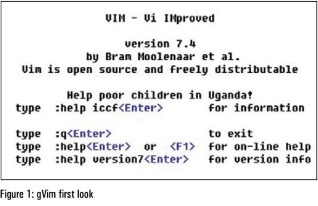
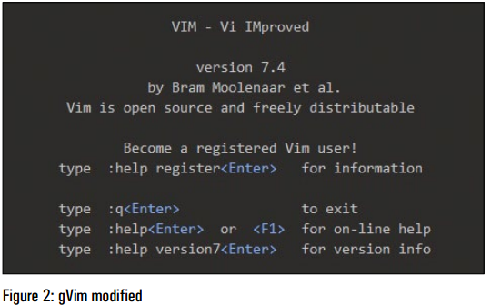
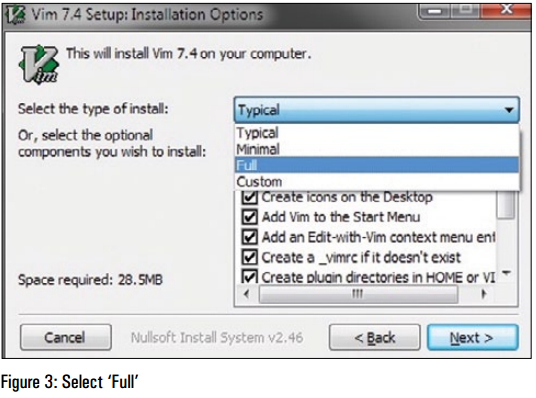
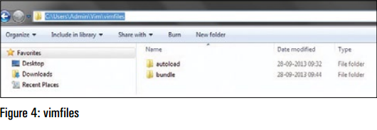
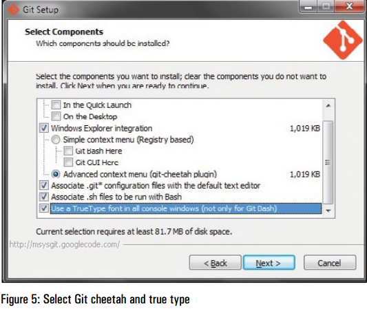
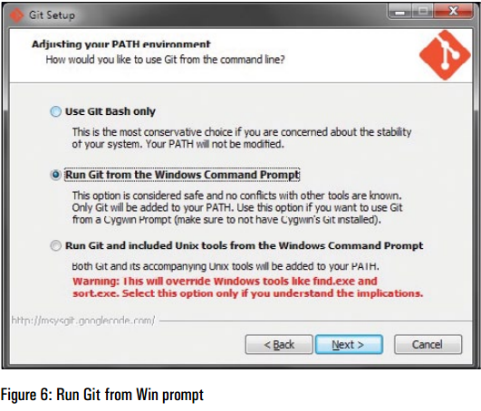
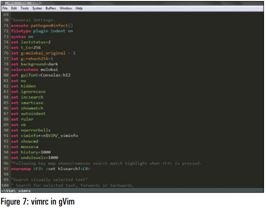

# 简单几步帮助你在 Windows 7 上安装 gVim #

## 原文 Pritesh Ugrankar[[注 1]](#foot-note-1) ##

翻译来源：[http://www.vim.org/ugrankar.pdf](http://www.vim.org/ugrankar.pdf)

Vim 是一款常见于类 Unix 系统的、基于 Vi 编辑器的文本编辑器。gVim 是 Vim 的 GUI （图形用户界面）版本。这篇文章详细介绍了如何在一台装有 Windows 7、Git、Pathogen 及一些（相关）插件的机器上安装 gVim。

早些时候我曾在 Linux 上使用过 Vim，不过我干的活儿都非常基础。大约 2 个月前，出乎意料地，我在我的工作笔记本的 Windows 7 上安装了 Vim 并尝试使用。最开始的那些日子里充满着沮丧和混乱，然而几周后，我开始感觉舒服多了。我很高兴我坚持下来了，因为如果没有了 gVim，最近的一些诸如验证、编辑、查找和替换一大堆命令和脚本的工作将花费我至少两倍或更多的时间。

Vim 的强大能力和可扩展性被插件大大增强了。如今，安装插件轻而易举：这一切都要感谢 Git 和 Pathogen。然而，在网上没有任何一步一步来（step-by-step）的指南来告诉你如何为安装在 Windows 7 上的 gVim 完成这些。我不得不在在网上各种信息的字里行间搜寻，通常都只有关于如何在 Windows 7 上安装 gVim 的蜻蜓点水般的资料。我花了一些时间把事情弄明白后，为自己写下这篇文章作为参考资料。然后我持续添加步骤，最终我觉得文章可能会帮得上其他人。

在我们开始前有一点要注意：我完全不是一个 Vim 专家，我只是两个月前才开始使用它，因此以下给出的步骤并非恰好就是完成这事的「真正的办法」。如果你知道完成这事的更好方法或者感觉可以改进方法，请让我知道。

为了确保这里给出的步骤能够正常工作，我完全卸载了 gVim、Git、Pathogen，然后当我重新装上它们的时候，我对屏幕进行了截图，捕获了命令行输出并写下这篇文章。

## 事件顺序 ##

1. 下载 Vim 并安装，移动/删除一些文件夹（目录）
2. 接下来，安装 Git 和 Pathogen：它们会使安装/卸载 Vim 的插件容易得多。我们也将在文件 *_vimrc* 中添加一些配置
3. 安装一些配色方案插件

基本而言，安装 gVim 时的情况如图 1 所示。

这非常清晰简单，且可以使用更好的字体和背景；因此在我们完成后稍作调整，情况就会变成图 2 所示的样子。

注意：从命令提示符（控制台版本）开始，Vim 将正常工作，不过这篇文章关注的是 gVim。

## 安装 gVim ##

你可以从 [http://www.vim.org](http://www.vim.org) 下载 gVim。事实上，你可以就在主页上找到下载 Windows 版本的链接[[注 2]](#foot-note-2)。

下载完成后，你可以就按通常那样安装在目录 *C:\Program Files (x86)* 下，不过最好把它装在你的 home 目录中。在我的例子里，这个位置就是 *C:\Users\Admin*。在你的 home 目录下建立一个被称为 Vim 的文件夹，并在安装时选择该目录。因此在我的案例中，这个位置就是 *C:\Users\Admin*。

**注意：**你应该在 'Vim' 中使用小写字母 'v'。我只是恰好喜欢 'Vim'

如图 3 所示，请记住在安装时选择 'Full' 选项。在你完成安装后，它将如图 1 所示。现在是时候改变些东西了。

## 打乱文件夹，把它们移走（？？？） ##

当你访问 Vim 文件夹时[[注 3]](#foot-note-3)，你会发现这样的状况：

1. 文件夹 vim74：存储 gVim/vim 可执行文件和其他相关文件
2. 文件 *_vimrc*： Vim 配置文件。在 Linux 下，这个文件是 *.vimrc*。
3. 文件夹 *vimfiles*：我们将在这里进行一系列改变。其中包含许多空文件夹。

**注意：**你可以跳过移动/删除文件夹，并简单地在 'vimfiles' 下创建 2 个文件夹：一个称为 'autoload'，另一个称为 'bundle'，但我更喜欢以下方法。这个方法工作正常并减少混乱（？？？reduces clutter）。

首先，删除文件夹 'vimfiles' 下的所有文件夹，然而不要删除 'vimfiles' 本身。其次，打开 'vim74' 文件夹，你会在这里发现名为 'autoload' 的文件夹——将其剪切并粘贴至 'vimfiles' 下，因此现在 'vimfiles' 下只有 'autoload' 文件夹。接下来，在 'vimfiles' 下创建一个名为 'bundle' 的文件夹。你的 'vimfiles' 文件夹现在有 2 个文件夹，分别是 'autoload'（这是你从 'vim74' 文件夹中移动过来的）和 'bundle'。

若你只是按上面提及的方法创建了新文件夹，且并未删除/移动文件夹，在这儿你有许多要做的。重新打开 gVim，确保你没有收到任何错误消息。如果你收到了错误消息，请重新安装 gVim 并按照以上步骤操作。

## Git 和 Pathogen：gVim 的插件能力（plugin power to gVim？？？） ##

简要地说，Git 是一个版本控制系统，程序员们可以在其中分享代码。当然，不仅仅如此，更多相关的信息可以从网上找到。

Pathogen 能让 Vim 用户生活得更容易些，它由 Tim Pope （一位 Vim 和 Vimscript 专家）编写。Pathogen 使安装/卸载插件变得非常容易。Vim 插件和相关文件遍布于 Vim 的许多目录中。添加/移除它们既痛苦又危险。谢天谢地，Pathogen 让这一切变得简单多了。

所以，我们来安装 Git 和 Pathogen 吧。

这里你要记住 2 件事情：首先，你必须确保勾选了 'Git cheetah plug-in' 选项。该选项很可能已经默认被选中了，但确认一下并无妨。'True type font option for Windows Console' 选项是可选的。

其次，在安装期间，确保勾选了 'Run Git from the Windows command prompt' 选项。

现在，打开命令提示符，键入命令 'git-version'。你应该会看到类似如下的信息：

    C:\Users\Admin>git --version
    git version 1.8.4.msysgit.0

这意味着 Git 按预期安装了。好事是 Curl 也跟着安装了，但我们需要确保可以通过命令提示符来运行它。所以，我们打开 *[https://github.com/gmarik/Vundle.vim/wiki/Vundle-for-Windows](https://github.com/gmarik/Vundle.vim/wiki/Vundle-for-Windows)* 并跟随标题为 'Curl on Windows' 下的说明进行操作。因为这哥们儿对于如何在 Windows 平台下安装 Git 和 Curl 给出了清楚的指导，可以去他的 GitHub 主页 *[https://github.com/gmarik](https://github.com/gmarik)* 上给他点个 'thank you'（？？？怎么做）。我们要把我们所有的感谢归于像 Tim Pope 和 'gmarik' 这样的哥们儿，正是他们做出惊人的玩意儿使安装插件变得如此容易。

正如那篇文章所示，复制、粘贴脚本，将其保存文件 *curl.cmd* 中（该文件位于 Git 目录下的 *cmd* 目录下）。在我的案例中，文件 *curl.cmd* 的完整路径如下所示：

    C:\Users\Admin\Git\cmd\curl.cmd

再说一遍，我把它安装在我的 home 目录中；你得到的可能是类似于 *C:\Program Files(x86)\Git* 的信息。

一旦完成了这步，运行命令 'curl –version'。

    C:\Users\Admin>curl --version
    curl 7.30.0 (i386-pc-win32) libcurl/7.30.0 OpenSSL/0.9.8y
    zlib/1.2.7
    Protocols: dict file ftp ftps gopher http https imap imaps
    ldap ldaps pop3 pop3s rtsp smtp smtps telnet tftp
    Features: AsynchDNS GSS-Negotiate IPv6 Largefile NTLM SPNEGO 
    SSL SSPI libz

现在，Curl 安装成功了。

接着，我们来安装 Pathogen。这时候输入 *cd* 回到 autoload 文件夹中并照下面这样运行命令 Curl：[[注 4]](#foot-note-4)

    C:\Users\Admin\Vim\vimfiles\autoload>curl -Sso pathogen.vim https://raw.github.com/tpope/vim-pathogen/master/autoload/pathogen.vim

快速检查以确认（？？？A quick check to confirm）：

    C:\Users\Admin\Vim\vimfiles\autoload>dir | find /I "pathogen.vim"
    28-09-2013 09:32 11,733 pathogen.vim
    
    C:\Users\Admin\Vim\vimfiles\autoload>

如上所示，Pathogen 确实安装好了。

## 向 _vimrc 添加配置 ##

是时候向 *_vimrc* 添加一些配置了。首先要备份该文件：复制该文件，或者粘贴到另一个文件夹，或者在同一个文件夹下但取名不同。我把它命名为 'vimrc_backup'。这个文件我们不打算对它进行别的操作。

现在，打开文件 *_vimrc*。你会看到其中的内容。除非你知道你在干什么，否则别修改这些内容。我们紧紧要在 *_vimrc* 的末尾添加如下几行。

这几行会让 Pathogen 工作并使插件可用（？？？It’s these lines that'll make Pathogen work and enable the plugins.）

    "Personal Settings.
    "More to be added soon.
    execute pathogen#infect()
    filetype plugin indent on
    syntax on

## 插件游戏！（？？？Plugin play!) ##

现在，是时候用 Pathogen 安装个插件了！对于初学者而言，我们就装一个称为 'kolor' 的配色方案吧。

**注意：**请确保你在目录 'bundle' 下，且只按照如下所示运行了命令。这确实非常重要。如果你在文件夹 'autoload' 下，或者回到 'bundle' 下，或者仅仅是开一个新的命令提示符并移动到 'bundle' 下。然后运行命令：

    git clone https://github.com/zeis/vim-kolor

    C:\Users\Admin\Vim\vimfiles\bundle>git clone https://github.com/zeis/vim-kolor
    Cloning into 'vim-kolor'...
    remote: Counting objects: 67, done.
    remote: Compressing objects: 100% (34/34), done.
    Uremote: Total 67 (delta 21), reused 66 (delta 21)
    Unpacking objects: 100% (67/67), done.
    Checking connectivity... done
    C:\Users\Admin\Vim\vimfiles\bundle>

如果一切运行正常，你应该看到类似如上所示的提示片段。

我怎么得到那个路径的？我在 GitHub 上搜索了 Vim colour schemes，点击其中一个搜索结果，复制 URL 并粘贴到 'git clone' 命令后。

如果你偏好亮色背景方案，使用上述方法试试看 'eclipse'。还有一个称为 'Molokai'。也试看看它。现在，重新打开 gVim 并在 'command mode' 下键入如下内容：

    :colorscheme kolor

类似地，尝试 ':colorscheme eclipse' 和/或 ':colorscheme molokai'。

命令行模式（command mode）下可使用 Tab 补全（命令）功能，从而用户不需要键入全部信息。

一旦你关闭 gVim，它就会忘记配置。我们要进一步调整我们的 *_vimrc*，从而保持配置，并且我们还要加入更多的一些功能。

向 *_vimrc* 中我们之前加的那些行下面加入以下几行，从而像如下片段所示。我们要设置配色方案、字体和其他配置。这完完全全就是我的 *_vimrc* 的一个副本，我已经用了它好些日子了，没有出现任何问题，所以这应该是可行的。如果你需要关于任何配置的更多信息，或者在 gVim 的命令提示符下键入 ':h setting'，或者在网上进行搜索。

    "Personal Settings.
    "More to be added soon.
    execute pathogen#infect()
    filetype plugin indent on
    syntax on
    "Set the status line options. Make it show more information.
    set laststatus=2
    set statusline=%F%m%r%h%w\ [FORMAT=%{&ff}]\ [TYPE=%Y]\[POS=%l,%v][%p%%]\ %{strftime(\"%d/%m/%y\ -\ %H:%M\")}
    "Set Color Scheme and Font Options
    colorscheme kolor
    set guifont=Consolas:h12
    "set line no, buffer, search, highlight, autoindent and more.
    set nu
    set hidden
    set ignorecase
    set incsearch
    set smartcase
    set showmatch
    set autoindent
    set ruler
    set vb
    set viminfo+=n$VIM/_viminfo
    set noerrorbells
    set showcmd
    set mouse=a
    set history=1000
    set undolevels=1000

保存文件 *_vimrc*。重新打开 gVim 并在命令行模式下键入 ':e $VIM/_vimrc'。

若正确添加了选项且没用冲突，你得 gVim 将具有漂亮的黑色背景和语法高亮，如图 7 所示。

## 注释 ##

1.  作者是一位开源爱好者，喜欢玩 Linux 和（？？？The author is an open source enthusiast who loves dabbling with Linux and……）其他开源工具来实现自动化的重复性任务（然而很少成功做到）。若有任何关于本文的疑问或意见，请写信给他，他的邮件地址是 pmu.rwx@gmail.com

2.   若你是 Windows XP 或者更高版本的 Windows，请直接复制地址 [ftp://ftp.vim.org/pub/vim/pc/gvim74.exe](ftp://ftp.vim.org/pub/vim/pc/gvim74.exe) 到下载工具中（注意：文件不大，若打算直接下载且你使用 ss 作为代理工具，请关掉 ss，直接连接，否则将出现连接失败的问题。这是在 Win 7 + Chrome 42.0.2311.135 (正式版本) m （64 位）/ Firefox 37.0.2 + Shadowsocks 2.3.1 测试得到的结果。

3. 用户需要先运行 $VIM\vim74\install.exe，才会生成文件夹 vimfiles 与 _vimrc。其中 $VIM 是指你的 VIM 安装目录，可在 VIM 中输入 `:echo $VIM` 得到该目录的地址（参见[资料 2](#ref-2)）。

4. pathogen 地址已经更改为 [https://raw.githubusercontent.com/tpope/vim-pathogen/master/autoload/pathogen.vim](https://raw.githubusercontent.com/tpope/vim-pathogen/master/autoload/pathogen.vim)

## 参考资料 ##

1. [Simple Steps to Help You Install gVim on Windows 7](http://www.vim.org/ugrankar.pdf)
2. [vi/vim使用入门: vimrc在哪儿?](http://easwy.com/blog/archives/where-is-vimrc/)